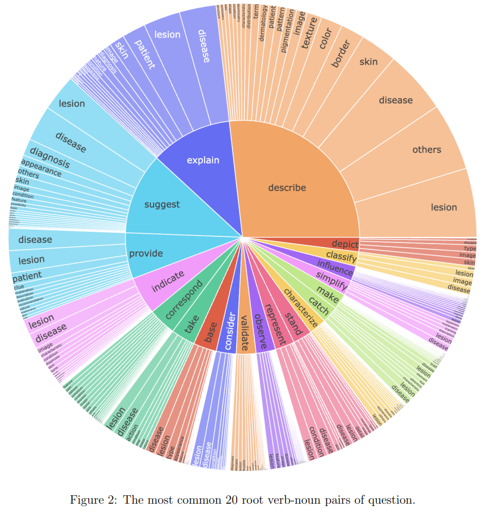

# DermaSynth

[](https://github.com/abdurrahimyilmaz/DermaSynth/DATA_LICENSE)

## Available Resources
- **DermaSynth**: [Hugging Face Dataset](https://huggingface.co/datasets/abdurrahimyilmaz/DermaSynth)
- **Derm12345 Part of the Dataset**: [Hugging Face Dataset](https://huggingface.co/datasets/abdurrahimyilmaz/derm12345_synthetic_data)
- **DermatoLlama 1.0** (Finetuned Model): [Hugging Face Model](https://huggingface.co/abdurrahimyilmaz/DermatoLlama-1.0)

## Data Download

<p align="center">
     <br>
 
  *The most common 20 root verb-noun pairs of question set is shown in Figure 2 which indicates the question set is diverse. Prompts spanned a wide range of question types—such as “What does this lesion look like?” and “Could this be X ?”—and were manually screened and selected for clarity and medical relevance.*
</p>

| DermaSynth Dataset | Size |
| --- | ---: |
| [derma_synth_92k.json](dataset/derma_synth_92k.json) | 52.4 MiB |

## Citation
Please cite the paper, if you use the data and code in your research:

```bibtex
@article{yilmaz2025dermasynth,
  title={DermaSynth: Rich Synthetic Image-Text Pairs Using Open Access Dermatology Datasets},
  author={Yilmaz, Abdurrahim and Yuceyalcin, Furkan and Gokyayla, Ece and Choi, Donghee and Erdem, Ozan and Demircali, Ali Anil and Varol, Rahmetullah and Kirabali, Ufuk Gorkem and Gencoglan, Gulsum and Posma, Joram M and Temelkuran, Burak},
  journal={arXiv preprint arXiv:2502.00196},
  year={2025}
}
```
